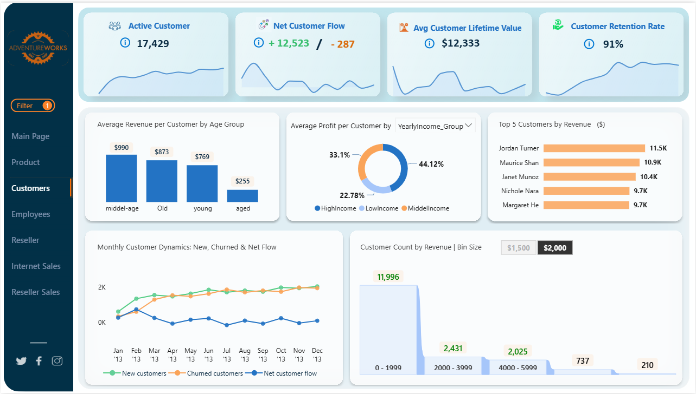
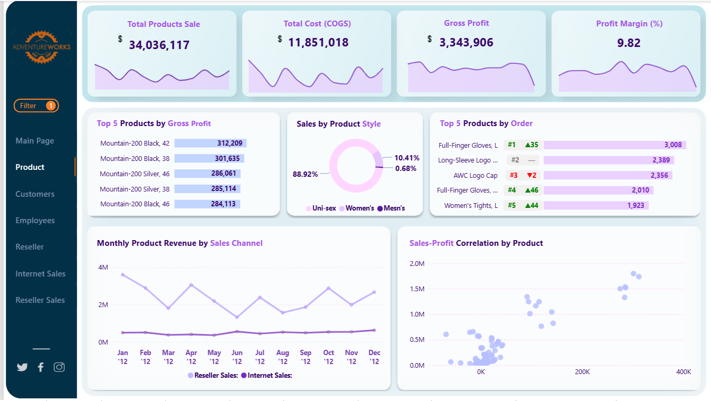
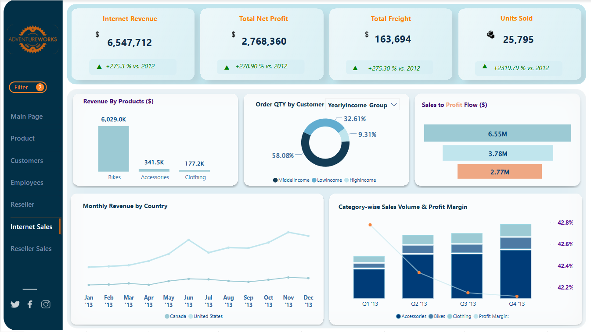

# 💡 AdventureWorks Power BI Dashboard

This is a multi-page interactive dashboard built with Power BI, based on Microsoft's AdventureWorks sample database. It visualizes product performance, internet sales, and other key business areas using modern UX design and data storytelling principles.

## 📌 Project Overview

This Power BI project is a **multi-page dashboard** that offers insights into various segments of the AdventureWorks dataset, including:

- **Product Performance**
- **Internet Sales**
- **Customer Segments**
- **Reseller Sales**
- **Reseller Overview**
- **Employee Metrics**

The dashboard layout was designed using **Figma** to ensure a clean and user-friendly experience before implementation in Power BI.

🔄 **Note:**  
This is the **first version** of the dashboard. Future updates will add enhancements in visuals, user experience, and analytical depth.

---

## ✨ Features by Page

### 👥 Customer Page

- **Real-life business KPIs** for customer analytics, including:
  - **Active Customer** – Shows the number of currently active customers in the business database.
  - **Net Customer Flow** – Tracks new customers acquired and customers lost in a given period.
  - **Avg Customer Lifetime Value (CLV)** – Calculates the average revenue generated by a customer over their relationship with the company (a critical real-world profitability KPI).
  - **Customer Retention Rate** – Indicates the percentage of customers retained over a specific time frame.
  
  - **KPI glossary**- Each KPI card includes an info tooltip (ℹ️) with a short definition from a dedicated KPI glossary table stored in the data model. This ensures all users have consistent, easy-to-access explanations for every metric.

- **Charts & Insights**:
  - **Average Revenue per Customer by Age Group** – Compares revenue contributions from `young`, `middle-age`, `old` and `aged` segments to identify high-value demographics.
  - **Average Profit per Customer by Customer Segments,** – Breaks down profit by `Marital satate`, `Yearly Income`, `Gender` , `Occupation` and `Education` segments.
  - **Top 5 Customers by Revenue** – Highlights the most valuable customers by total spend.
  - **Monthly Customer Dynamics** – Displays trends for new, churned, and net customer flows over time.
  - **Customer Count by Revenue (Bin Size)** – Groups customers into revenue bins to reveal distribution patterns.

- **Purpose**: This page is designed to give executives and marketing teams actionable insights into customer behavior, retention, and profitability, enabling targeted strategies for growth and loyalty.


### 📦 Product Page

- Redesigned layout using Figma before building in Power BI for a more intuitive UX.
- Removed unused whitespace to provide more space for visual elements.
- Added **ranking in the stacked bar chart** to highlight top-performing products by Order Quantity.
- Created **a dynamic tooltip** to show the ranking of each product compared to the previous year.
- Included **interactive buttons** that change color dynamically when selected (UX improvement).
- Built **a custom tooltip** that displays which slicers are selected, helping users understand the filtered context.

### 🌐 Internet Sales Page

- KPI cards at the top include **dynamic Year-over-Year (YoY) comparison** vs. the previous year.
- Each KPI card includes **conditional formatting** to indicate growth or decline.
- Visuals include product revenue breakdown, order quantity by customer segments, profit flow, monthly revenue by country, and category-wise sales volume with profit margin trends (📊 see "Category-wise Sales Volume & Profit Margin" chart).
- Designed for both **business overview** and **granular drill-down** into internet sales insights.

---
## 📸 Dashboard Previews

### Product Dashboard
  
*Actionable insights into customer behavior, retention, and profitability*


### Product Dashboard
  
*Product performance metrics and rankings.*

### Internet Sales Dashboard

*YoY trends, customer segments, and revenue breakdown.*


## 🛠 Tools Used

- **Power BI**
- **Figma** – for planning and designing the layout
- **DAX** – for dynamic calculations and tooltips

---

## 📁 Folder Structure

```text
AdventureWorks-PowerBI-Dashboard/
│
├── assets/
│   └── dashboard-screenshots/
│       ├── product-page.png
│       └── internet-sales-page.png
│
├── pbix/
│   └── AdventureWorks_Dashboard.pbix
│
├── figma/
│   └── dashboard-design.fig
│
├── README.md
└── LICENSE (optional)
